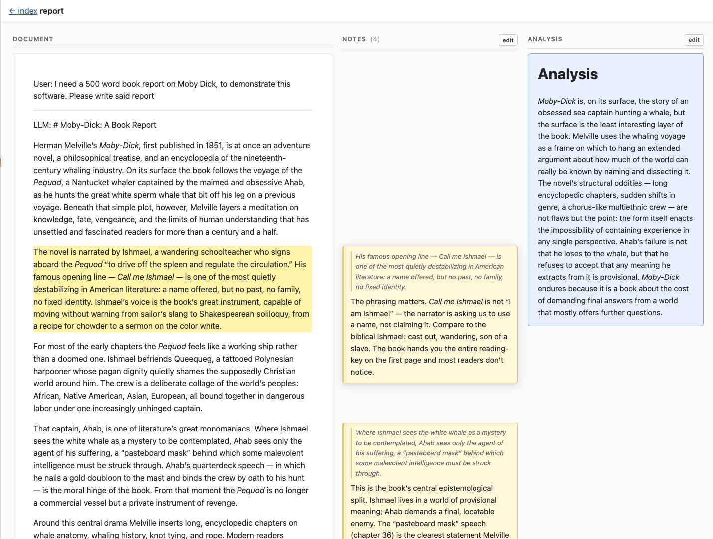

# An experimental take on Markdown annotions and LLM interactions

Chat interfaces are optimized for the next message; research is optimized for the previous one. This project replaces the chat scrollback with an annotated document — a place where the good chunks of an LLM conversation can be marked, summarized, and reread.

The solution is [three Markdown documents](https://www.youtube.com/watch?v=iR8T1h3_jps).

## Interested in supporting the idea of alternatives LLM interfaces?

[I take tips via Ko-fi](https://ko-fi.com/rwilcox), or [email me using my contact form](https://www.wilcoxd.com/contact.html)

# The Markdown Annotation Spec

Each research topic has 2-4 associated Markdown documents

## The Conversation Document (.md)

A Markdown document that records the user's questions and the LLM's responses, in the following format:

```markdown

User: (question)

---

LLM: (answer)

---
```

## The Notes Document (.notes.md)

When a user wants to highlight, reply to, or expand on some generated content, they use the Markdown blockquote syntax

```markdown

> this is text from the prompt document

This is my (optional) commentary.

```

Markdown Annotator will render these comments beside the appropriate area in the prompt document

## The Analysis Document (.analysis.md)

Research with an LLM is a means, not an end: the goal is a plan, a position, a way forward — not the conversation that produced it. Quoting and annotating individual passages captures the local insights; broader, synthesizing thoughts go in the analysis document.

## The Table of Contents Document (.toc.md)

A long conversation document gets hard to scan. An optional `<name>.toc.md` adds a searchable, click-to-jump outline that lives in a disclosure panel in the page header.

The file is just a markdown bullet list. Each item is one navigation entry; nested lists become nested entries.

```markdown
- [Friendly label](text to substring-match in the doc)
- A plain entry that is also the search text
  - Nested entries work too
```

How an entry is matched to a document location:

  * If the item is a markdown link `[label](text)`, the **label** is shown in the table of contents and the **text in parentheses** is substring-matched (case- and whitespace-insensitive) against the document's blocks. The first matching paragraph/heading/list is the click target.
  * If the item is plain text, that text serves as both the displayed label and the search target.
  * Items that don't match anything in the document render in muted gray (no click target).

Clicking an entry smooth-scrolls the document column to the matched block and briefly flashes it. The disclosure panel also has a filter input that hides non-matching entries as you type.

# What this all means

With these series of documents you have a record of the conversation you can return to, highlights and thoughts you believed were useful in the moment, and the analysis/syntheses of these ideas towards a comprehensive plan of action.

# The UI in action



# LLM chatting

While you are doing analysis work you can continue your conversation with an LLM right in Markdown Annotator. Prompts and responses are automatically appended to the Conversation Document.

# Notes

Notes:
  * Early versions of this repo were heavily vibe-coded.
  * The server reads documents from `~/Documents/markdown_analysis`. Place your conversation.md, conversation.notes.md and conversation.analysis.md documents in this folder
  * `npm start` to run the server, visit [localhost:3000](http://locahost:3000/)


# Requirements

Requirements:
  * Node 24
  * [LLM CLI](https://github.com/simonw/llm/)
